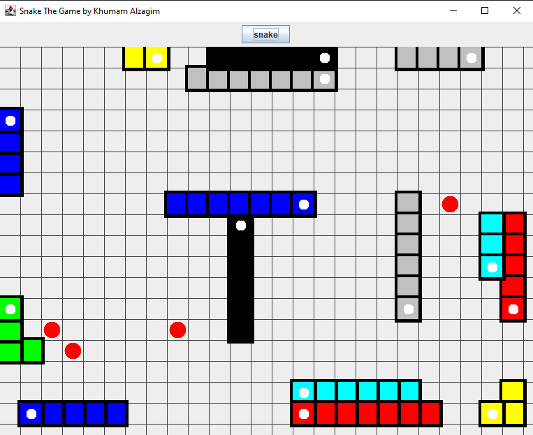

# Java Snake Spawning Game

## Overview
This Snake Game is a Java-based application that features a dynamic snake environment. Players can spawn snakes by pressing a "Snake" button. Each snake moves randomly across the screen, operating on its own thread. The game includes randomly spawning food that makes the snakes grow when eaten. If snakes collide with each other, they lose size, and snakes that shrink to a size less than one will die. The game window is resizable, adapting to various screen sizes.

## Features
- **Multi-threaded Gameplay:** Each snake operates on a separate thread, ensuring smooth and independent movement.
- **Snake Generation:** Players spawn new snakes by pressing a "Snake" button.
- **Random Movement:** Snakes move randomly across the screen, making each game unpredictable.
- **Food Mechanism:** Randomly appearing food makes snakes grow upon consumption.
- **Collision Dynamics:** Snakes shrink in size upon colliding with each other. A snake dies when its size becomes less than one.
- **Resizable Game Window:** The game adapts to different screen sizes, providing a flexible gaming experience.

## How to Play
1. **Start the Game:** Launch the Java application to open the game window.
2. **Spawn Snakes:** Click the "Snake" button to create a new snake on the screen.
3. **Watch and Interact:** Observe the snakes as they move randomly. There are no player controls for the snakes; their movement is automated based on the game's logic.
4. **Game Objective:** The goal is to grow your snakes as large as possible by eating food and avoiding collisions with other snakes.

## Installation
To set up the game on your local machine, follow these steps:

1. Clone the repository:
   ```bash
   git clone [this repository URL :D]
   
## Note:
This game was created back in 2020 for GUI project course during my Sophomore years.